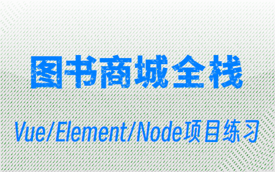
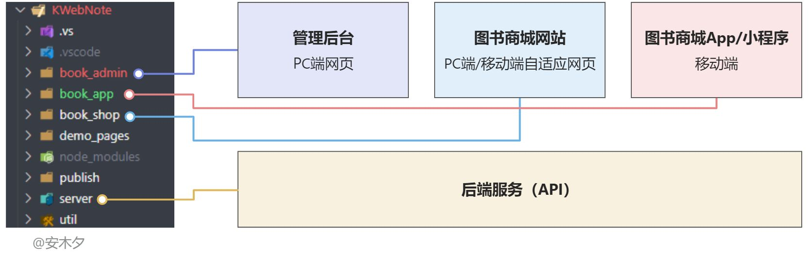

# KWebNote

* **📁 demo_pages** ：一些单独的页面demo
* 其他为图书商城Vue+Element+Node+TS项目练习

---

# 图书商城Vue+Element+Node+TS项目练习

在线地址： http://kanding.gitee.io/kwebnote

本项目是为学习Vue的项目练习，尽量详细记录一下一个完整项目的开发过程。面向初学者，本人也是初学者，搬砖技术还不成熟。项目在技术上勉强算是全栈，从基础的数据库（Sqlite）、到后端服务Node.js（Express），再到Web端的Vue，包含服务端、管理后台、商城网站、小程序/App。

* **📁 book_admin**：[图书后台管理系统](/book_admin/README.md)，`Vue2`+`ElementUI`
  - 图书系统的管理后台，管理员或商家使用。提供了登录、图书管理、订单管理、字典管理等各种管理功能，满足系统的运营、管理需求。
  - 采用Vue2版本为主的技术栈，其他还包括ElementUI、vuex、vue-router、axios、echarts、i18n、less等。

* **📁 server**：[后端服务](/server/README.md)，`Node`+`Express`+`Sqlite3`
  - 数据库+后台API服务，为前台应用提供登录服务、文件管理服务、数据管理服务等功能。
  - 采用Node+Express为主的技术栈，数据库使用的轻量级关系型数据库Sqlite3。

* **📁 book_shop**：[图书商城](/book_shop/README.md)，`Vue3`+`TypeScript`
  - 面向C端用户的图书商城网站，自适应PC端、移动端浏览器
  - 进行中

> **🪧相关文章**：
> - [图书商城Vue+Element+Node+TS项目练习](https://www.yuque.com/kanding/ktech/hug6bigq29z7mq0p)🔗
> - [图书商城①管理后台Vue2+ElementUI](https://www.yuque.com/kanding/ktech/ddvf8utw8t8xrqek)
> - [图书商城②后端服务Node+Express+Sqlite](https://www.yuque.com/kanding/ktech/te6pvvp4ufgm4n3k)
> - 图书商城③商城网站Vue3+TS
> - 图书商城④商城APP端Vue3+TS+uniapp

