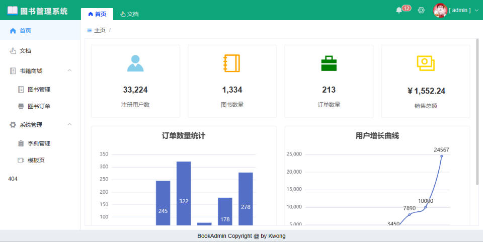

# bookadmin 图书后台管理系统

这是一个比较典型的管理后台练习项目，包含登录、框架页、导航路由、导航标签、数据管理、字典管理等基础功能。管理后台的业务大多是数据管理CRUD功能，该项目只是是简单实现了几个模块。同时针对CRUD，整理了一个模板📁template。

🔸**技术路线**：

- Vue v2.*
- ElementUI v2.*

🔸**相关组件**：

- `vuex`：状态管理
- `vue-router`：前端路由
- `axios`：HTTP调用
- `echarts`：图表组件，按需定制
- `i18n`：多语言国际化`vue-i18n`v8.*版本
- `@wangeditor`：富文本编辑器
- `Less`：CSS预处理器/语言


🔸**源代码地址**：[Github / KWebNote](https://github.com/kwonganding/KWebNote)，[Gitee / KWebNote](https://gitee.com/kanding/KWebNote)，管理后台代码在目录📁[book_admin]下。

🔸**在线体验地址**[🔥🔥](https://www.yuque.com/go/doc/109169187)：[http://kanding.gitee.io/kwebnote](http://kanding.gitee.io/kwebnote) （任意用户名、密码。通过gitee静态页面Gitee Pages部署的，所以这里部署的版本是写了个mock模拟api，路由用的hash模式）。




---

# Project setup
```
npm install
```

### Compiles and hot-reloads for development
```
npm run serve
```

### Compiles and minifies for production
```
npm run build
```

# 其他备注

## 资源URL规则：

* `/`   ：基于 `public` 根目录的**绝对路径**
* `../` ：相对路径，上一级路径
* `~`   ：指向模块 `node_modules` 中的资源
* `@`   ：指向 `<projectRoot>/src` 的一个路径别名